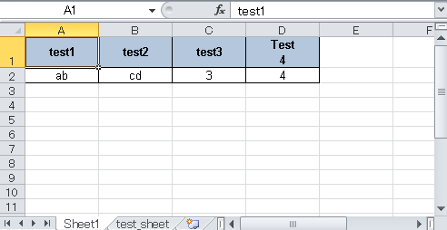
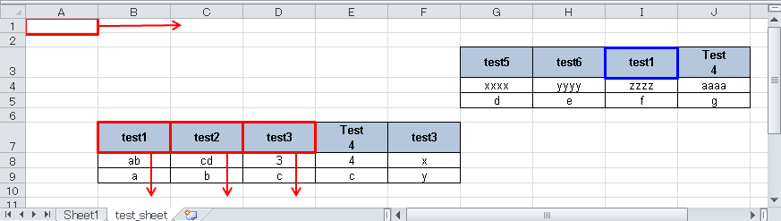

# xlsx_extractor

Tool to extract data from xlsx(xlsm) by specifying headers.

## Description

**xlsx_extractor** is extracts data by specifying a header string.

For example, if you have the following Excel files and specify `test1` and `test2` as headers, you will get `ab,cd` and extraction results.



```console
$ xlsx_extractor --file tests/test.xlsx -d , test1 test2
test1,test2
ab,cd

```

Find the rows in the sheet where all the specified headers exist, and output the data after the headers in the order of the specified headers.

```console
$ xlsx_extractor --file tests/test.xlsx -s test_sheet -d , test2 test1 test3
test2,test1,test3
cd,ab,3
b,a,c

```

## Usage
```dumb
$ xlsx_extractor --help
Tool to extract data from xlsx(xlsm) by specifying headers.

Usage: xlsx_extractor [OPTIONS] --file <XLSX> [HEADERS]...

Arguments:
  [HEADERS]...  Header names

Options:
  -f, --file <XLSX>            Excel file(.xlsx or .xlsm)
  -d, --delimiter <DELIMITER>  Output delimiter [default: "\t"]
  -s, --sheet <SHEET>          Sheet name
  -H, --header                 Suppress header output
  -q, --quote <QUOTE>          Quote [default: "]
  -t, --style <STYLE>          Quote Style [default: necessary] [possible values: always, necessary, non-numeric, never]
  -o, --output <FILE>          Place the output into <FILE>
  -h, --help                   Print help
  -V, --version                Print version

```

The tool searches for cells with the header names specified by HEADERS, starting from the upper left corner of the sheet. The rows in which all headers are found are recognized as headers.



```dumb
$ xlsx_extractor --file tests/test.xlsx -s test_sheet -d , test2 test1 test3
```
When you execute the above command on a sheet like the one shown in the figure, the tool first looks for the header name starting from cell A1 in the right direction. If the header is not found in the row, it proceeds to the next row. In the figure, cell I3 contains the letters specified as headers, but not all the headers specified are present, so the tool does not recognize it as a header row.
Since all the header strings are present in line 7, this line is recognized as the header line.
The next line after the header line is the data line. In the figure, columns B, C, and D with arrows are extracted. The output order of the columns is the order specified in HEADERS.

As a result,
```dumb
test2,test1,test3
cd,ab,3
b,a,c

```
is output.

If you do not want to output headers, do the following.
```console
$ xlsx_extractor --file tests/test.xlsx -s test_sheet -d , -H test2 test1 test3
cd,ab,3
b,a,c

```

To output to a file, use the following.
```dumb
$ xlsx_extractor --file tests/test.xlsx -s test_sheet -d , -o test.csv test2 test1 test3
$ cat test.csv
test2,test1,test3
cd,ab,3
b,a,c

```


### Escape sequence

You can use escape sequences for headers.If you wish to designate cell E7 as a header, do the following
```console
$ xlsx_extractor --file tests/test.xlsx -s test_sheet -d , test2 test1 test3 Test\\r\\n4
test2,test1,test3,"Test
4"
cd,ab,3,4
b,a,c,c

```

Headers containing newlines are enclosed in double quotation marks. The default setting is to quote when necessary.

You can use escape sequences also in delimiters and quotes.
```dumb
$ xlsx_extractor -f tests/test.xlsx -s test_sheet -d \\t -q \' test2 test1 test3 Test\\r\\n4
test2   test1   test3   'Test
4'
cd      ab      3       4
b       a       c       c

```

### Quoting style
You can specify a quoting style.
- always
```console
$ xlsx_extractor -f tests/test.xlsx -s test_sheet -d , -t always test2 test1 test3 Test\\r\\n4
"test2","test1","test3","Test
4"
"cd","ab","3","4"
"b","a","c","c"

```

- necessary
```console
$ xlsx_extractor -f tests/test.xlsx -s test_sheet -d , -t necessary test2 test1 test3 Test\\r\\n4
test2,test1,test3,"Test
4"
cd,ab,3,4
b,a,c,c

```

- non-numeric
```console
$ xlsx_extractor -f tests/test.xlsx -s test_sheet -d , -t non-numeric test2 test1 test3 Test\\r\\n4
"test2","test1","test3","Test
4"
"cd","ab",3,4
"b","a","c","c"

```

- never
```console
$ xlsx_extractor -f tests/test.xlsx -s test_sheet -d , -t never test2 test1 test3 Test\\r\\n4
test2,test1,test3,Test
4
cd,ab,3,4
b,a,c,c

```
